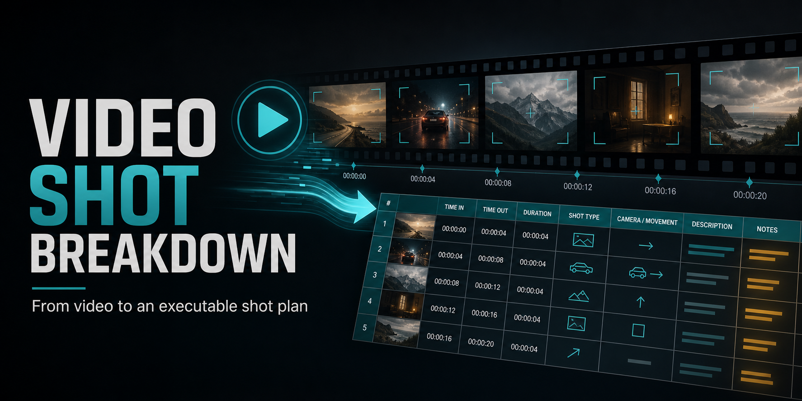

# Video Shot Breakdown



[](SKILL.md)
[](LICENSE)
[](https://github.com/mt11501368-lgtm/video-shot-breakdown/stargazers)

[中文](#中文说明) | [English](#english)

## 中文说明

把一个视频变成可验证的逐镜拉片、创作规律总结和可执行的复刻拍摄表。它不只告诉你“这个视频很好”，而是尽量回答：**为什么有效，以及下一条该怎么拍。**

### 适合谁

- 想系统学习优秀短视频的创作者
- 需要快速产出分镜、拍摄清单和剪辑时间轴的团队
- 想拆解广告、剧情、口播、产品展示或 AI 视频的导演与剪辑师

### 核心能力

- 分析 MP4、MOV、MKV、WebM 视频
- 提取关键帧、接触表、场景候选和音频证据
- 按叙事镜头整理画面、运镜、剪辑、台词和声音
- 分别生成学习分析与模仿复刻方案
- 输出带关键帧的 Excel 工作簿
- 对不确定的台词和创作意图明确标注推断，而不是编造答案

### 快速安装

Windows PowerShell：

```powershell
git clone https://github.com/mt11501368-lgtm/video-shot-breakdown.git "$env:USERPROFILE\.codex\skills\video-shot-breakdown"
```

macOS / Linux：

```bash
git clone https://github.com/mt11501368-lgtm/video-shot-breakdown.git ~/.codex/skills/video-shot-breakdown
```

安装完成后重启 Codex。

### 直接这样用

把视频文件发送给 Codex，然后复制任意一句：

```text
帮我对这个视频做完整逐镜拉片，生成学习分析和模仿复刻 Excel。
```

```text
分析这个广告为什么有效，逐镜说明构图、运镜、剪辑、声音和情绪作用。
```

```text
把这个视频拆成可直接执行的复刻拍摄表，包含时长、演员走位、机位、台词、声音和剪辑点。
```

更多场景见 [示例提示词](examples/prompts.md)。

### 你会得到什么

1. 视频元数据、音频和关键帧证据
2. 按叙事逻辑校正后的逐镜表
3. 学习分析 Excel：解释每个镜头为什么有效
4. 模仿复刻 Excel：把每个镜头转成可拍摄、可剪辑的执行方案

### 依赖

- Python
- FFmpeg / FFprobe
- Pillow
- openpyxl
- faster-whisper（可选，用于语音转录）

检查当前环境：

```powershell
python scripts/check_dependencies.py
```

### 工作流程

```text
视频 → 元数据/关键帧/音频 → 人工语义校正 → 分析 JSON → Excel 工作簿
```

自动场景检测只作为线索。Skill 会优先按主体、场景、机位、动作和叙事功能整理镜头，减少闪白、抖动和 AI 变形造成的错误切分。

### 项目结构

- `SKILL.md`：Skill 主工作流
- `scripts/`：视频探测、转录和 Excel 生成脚本
- `references/`：数据结构与分析规范
- `examples/`：可复制的使用提示词
- `agents/`：Codex 展示配置

### 参与项目

如果这个 Skill 帮你节省了时间，欢迎点一个 Star、分享你的分析案例或提交 Issue。贡献代码前请阅读 [CONTRIBUTING.md](CONTRIBUTING.md)。

---

## English

Turn a video into an evidence-backed shot breakdown, transferable creative lessons, and an executable replication plan. The goal is not merely to say that a video works, but to explain **why it works and how to produce the next one**.

### Who It Is For

- Creators studying successful short-form videos
- Teams producing storyboards, shot lists, and edit timelines
- Directors and editors analyzing ads, narrative clips, product videos, or AI video

### What It Does

- Analyzes MP4, MOV, MKV, and WebM videos
- Extracts keyframes, contact sheets, scene candidates, and audio evidence
- Organizes visuals, camera movement, editing, dialogue, and sound by narrative shot
- Produces separate learning-analysis and replication plans
- Exports Excel workbooks with embedded keyframes
- Labels uncertain dialogue and inferred intent instead of inventing details

### Quick Install

Windows PowerShell:

```powershell
git clone https://github.com/mt11501368-lgtm/video-shot-breakdown.git "$env:USERPROFILE\.codex\skills\video-shot-breakdown"
```

macOS / Linux:

```bash
git clone https://github.com/mt11501368-lgtm/video-shot-breakdown.git ~/.codex/skills/video-shot-breakdown
```

Restart Codex after installation.

### Try It

Attach a video in Codex and use one of these prompts:

```text
Break this video down shot by shot and generate learning-analysis and replication Excel workbooks.
```

```text
Explain why this ad works, covering composition, camera movement, editing, sound, and emotional purpose for every shot.
```

```text
Turn this video into an executable replication plan with duration, blocking, camera setup, dialogue, sound, and edit points.
```

See [example prompts](examples/prompts.md) for more use cases.

### Outputs

1. Video metadata, audio, and keyframe evidence
2. A narrative shot list corrected beyond raw scene-detection cuts
3. A learning-analysis workbook explaining why each shot works
4. A replication workbook translating each shot into a production plan

### Requirements

- Python
- FFmpeg / FFprobe
- Pillow
- openpyxl
- faster-whisper (optional, for speech transcription)

Check your environment:

```powershell
python scripts/check_dependencies.py
```

### How It Works

```text
Video → metadata/keyframes/audio → semantic shot correction → analysis JSON → Excel workbooks
```

Automatic scene detection is treated as a hint. The workflow groups shots by subject, location, camera setup, action, and narrative purpose to reduce false cuts caused by flashes, shake, and AI morphing.

### Contributing

If this skill saves you time, consider starring the repository, sharing an analysis example, or opening an issue. See [CONTRIBUTING.md](CONTRIBUTING.md) before submitting code.

## License

[MIT](LICENSE)
